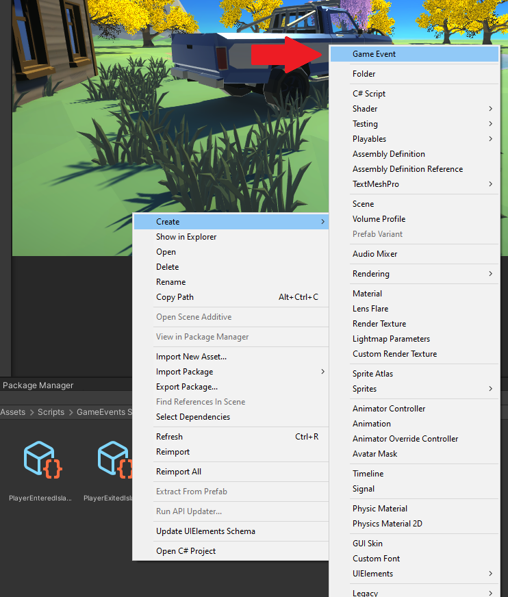
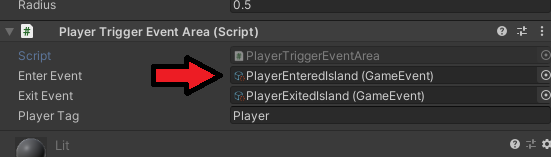
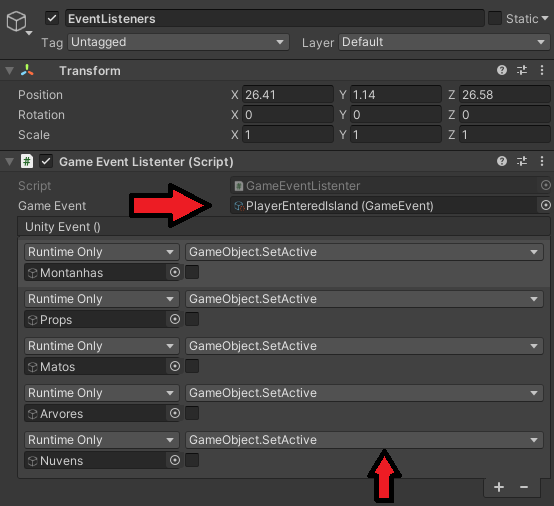

# Unity_GeneralEventSystem
Quick and easy to implement Event system to trigger whatever you wish in game.

Easily create events and implement trigger events or whatever else you want.

### How to use:

#### 1) Create an event so it can be triggered and listened to.

#### 2) Assign that event somewhere you want to trigger it.

#### 3) Create a listener to that type of event and choose what you want to do.

#### 4) Done :D!